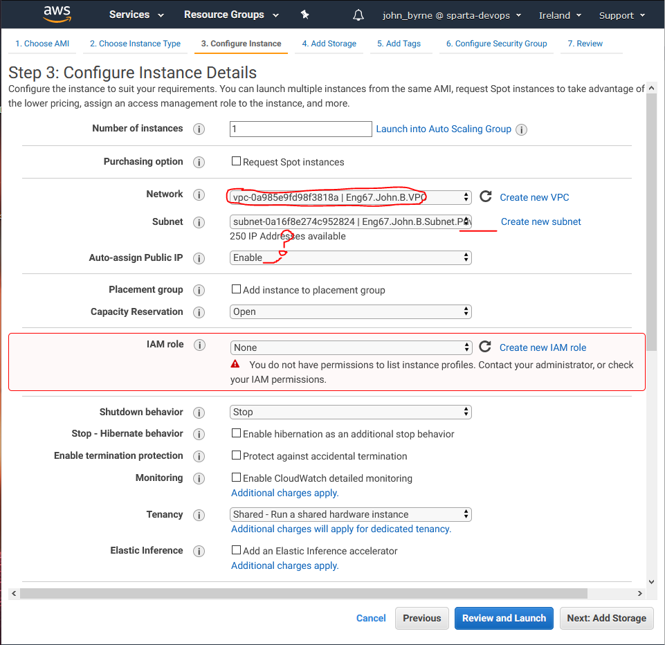
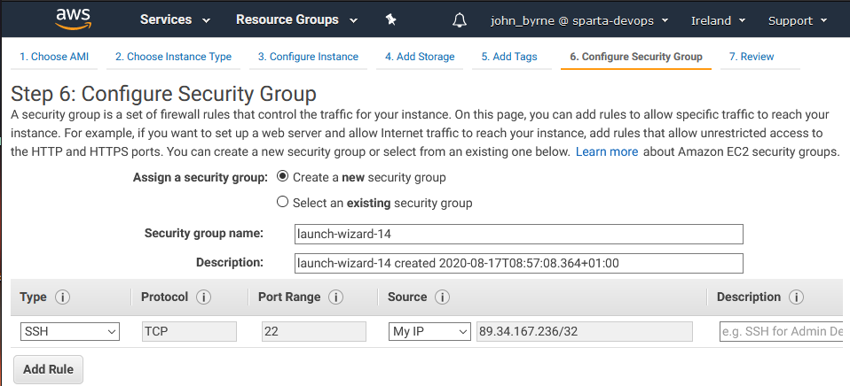

# Setting up a Bastion Server on AWS

**What is a Bastion server?**

A bastion server is a hardened Linux box that allows the network owner to login and access the rest of the servers available even in the **private subnet** via **SSH**. Of course for this to happen the bastion needs a respectively configured security group to allow this. Generally the servers or in our case **EC2** instances are blocked from direct access by security group rules, and often don't directly route to the outside world, unless attached to a **IGW** and appropriate **SG** with **HTTP** and **HTTPS** inbound and outbound rules to allow communication.

In this case we actually used our Bastion as a sort of trampoline, or jump server into our private subnet which is quite difficult to get into through any other means. We SSH into the Bastion and allow the DB to accept inbound **SSH** rules so that it can actually be accepted and allow the developer to create and populate a database before removing the internet access so it is more secure inside its **private subnet**.

### Step 1

First lets go to AWS navigate to **EC2** instances page and click the **Launch instance** button. We are going to create our bastion using the **EC2** machines provided by Amazon. 

**Configuration**
* **Network** : Your **VPC**
* **Subnet** : Your **private subnet**
* **Public IP** : Enable / Disable (Makes no difference)

Now for the **Security Group** you need to add your own IP along with the SSH port as this allows you to SSH from the **bastion** into the database instance. From inside that instance you can install the necessary database provision to get the database up, but that will need to be done once the instance has internet access.

The next part allows all database requests coming from the web app to be accepted as we have added its SG to the things that should be allowed through the **Bastions** own SG.

