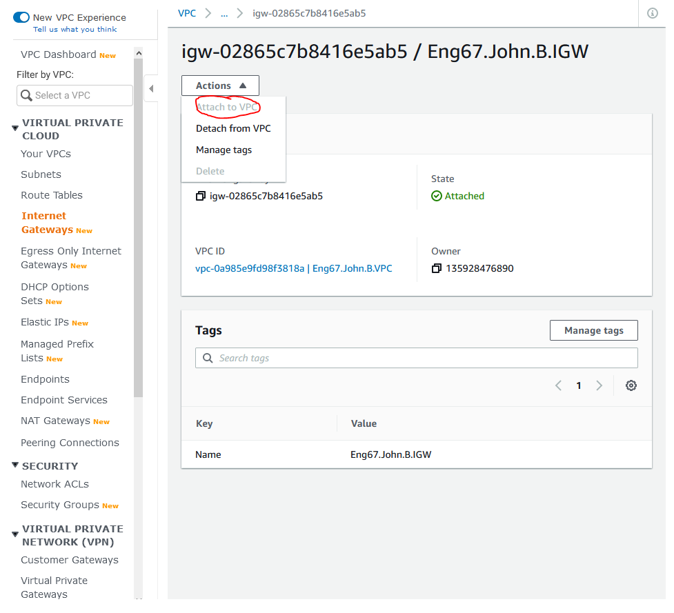
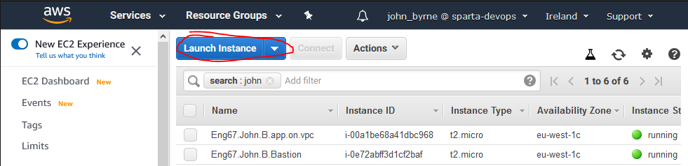

# Setting up a VPC (Virtual Private Cloud on AWS)

## Creating the VPC

First thing is first we want to Create out **VPC** so to do that navigate to the **VPC** page on Amazon and click **Create VPC**

* Note : Use a meaningful name so it can easily be identified, use a IPv4 that is not taken by anyone else in your network to avoid problems later on.
* Note : Check the `No Ipv6 CIDR BLock` and create it!


## Creating the Internet Gateway

Next we are going to create our **Internet Gateway** to provide internet for our **Subnets**, well only the public one for the time being.

Navigate to the **Internet Gateways** and Click **Create Internet Gateway**


It should now saw **Detached**, when you click create as it is not current attached to any networking entity. We are going to attach it to the VPC we just created.

Click **Actions** in the top left and click **Attach VPC** then when the search box appears look for the **VPC** we just created and click **Attach**



## Creating the Subnets _Public_ and _Private_

Now we are going to create the **Subnets**, a **private** and **public** one so that we can create a level of security in our design. We plan to place the App inside the **public** one which has access to the internet, and the DB inside the **private** one which does not have access to the internet at the moment.

Navigate to **Subnets** and click **Create Subnet**


Here we are creating the **public subnet** and we are going to give it a slightly different IP so it is still associated with the **VPC**, here I have replaced the third **octet** with a **3** but you could use **1** or **2**. Any number betweeen the **0 - 255** is valid here.

The same rules apply here for the **private subnet** just make sure it is **NOT** the same IP as either the **public subnet** or **VPC** exactly.


Create this **subnet** too, we now have both the public and private subnet.

In my case:

* **Public Subnet** : 109.10.1.0/24

* **Private Subnet** : 109.10.2.0/24

We also need to now Attach the **IGW** to a **Route Table** otherwise it will not be able to know which of the subnets is its target by default. Usually this is done by having one as the **main route**. By default **subnets** come with less internet, this is good because it allows you to control the amount of internet access it has.

## Create Route Table

We now need to create this **Route table** so we can tell the **IGW** exactly where to go to when it comes into the **VPC**.

Before we create the **Route table** we first need to go to the **Route table** tab in AWS and search the name of your **VPC** in the search bar. It should come up with a blank entry. This is your default **Route** and is technically your **private subnet** association as it doesn't have internet by default which is what we want. 

Rename this with a good naming convention making sure to label it as your **Private Route** and the **Main Route** too.


Okay, now click **Create Route Table**. 


Following the same naming convention create the **public route table**. Then go back to the **Route Tables** page and search your VPC and you should see your **private** and **public** route tables both there.


Now Click that **public Route** and then go down to the **Routes** tab and click **Edit Routes**.


When inside you need to click **Add Route** and add the connection for your **IGW** so to give it internet.

* The destination of the new route is **0.0.0.0/0** and the Target is your **IGW**. The 0 is kind of a representation of the world, E.G. any traffic from the internet. **Save** that and go back.


Now we want to create a **subnet** association with our **public Route**, to do that select the **public Route** and go to **subnet associations** and click **Edit subnet associations**.


Select your **public Subnet** and click **Save**.


As for the **private subnet**, if you click that in the **Route tables** and go to **subnet associations** you can see that it is the **main route** therefore the private **subnet** will automatically be associated with it. 


# Network ACLs
## Building the Security Groups for our VPC / Subnets

The Network **ACL** is like a second layer of protection for the **Subnet** it is the first barrier of defence that is met by anything coming from the **Route table** and then once inside it can interact with the instances as long as it can get past their first layer of protection known as a **Security group**.

In the **NACL** you can allow and Deny incoming traffic by specific IPs or ports making them an intricate piece of network security.

To Start go to the **NACL** tab in AWS and then search for your **VPC** in the search tab and this is how your **VPC** should look at present.


From that page Select the **Create network ACL**.

We are going to create two of these **NACLs** as we need one for each of our subnets, one for the **private subnet** that is very restrictive and one for the **public subnet** which is a little more leanient.

The first **NACL** you create need to be called something that you can easily identify, so for example call it a **NACL.Public** with a good naming convention of course!


By Default your New **NACL** will automatically have its **inbound rules** and **outbound rules** set to **DENY ALL** E.g. DENY ALL FROM **0.0.0.0/0**.


The first thing we will do is change the **inbound rules** so we can do the necessary things like allow communication between the **database** and **webapp** byt adding the default **mongodb** port and also using the **private subnet** as a source in order to allow any connections. We will also add ports **443 | HTTPS and 80 | HTTP** to give internet access to our public subnet.


Now after that for the **outbound rules** we are going to be a little probmatic there any allow everything out .

This can be done by selecting **All TCP** and clicking **save**.

The next important step here is to check if the **public ACL** we just created is associated with the public subnet, to check select it in the list and then click **subnet associations** and it should look like so.


# Launching EM2 Instance

First Navigate to the **EC2**(Elastic Compute Cloud) Services page and then **Launch** a new **EC2 Instance**.




Now I have done this step multiple times in my last creation process so I am going to explain here using images where things have changes.

### step 1

Choose Your relevant AMI with the correct OS version. For me **ubuntu 16.04**

### Step 2

Choose a relative size instance

### step 3 

Here we need to connect to the **VPC** network that we just created in order to create this instance inside, we also want to then place it inside the **public subnet** we just created aswell. We also want it to automatically assign this instance a public ip address.


### step 4

Add Storage

### Step 5

Add A relevant and descriptive name tag, I used: **NAME** : **Name.Instance.VPC.WebApp**

### Step 6

Here we do need to create a new **Security Group** So give it a name similar to that in the last step except make sure you end with **SG** to make it identifable.

For Now we are going to allow traffic. So:

* **Type** : ALL TCP
* **Protocol** : TCP
* **Port Range** : 0 - 65535 
* **Source** : Your IP

This allows all traffic from your IP.

Then review the Key pair and for me I needed to choose the **DevOpsStudents** Key to allow SSH into the Instance.

Now your instance has been made and you can see it in the **EC2** Instances tab inside the. Lets try Log into the Instance using our **GitBash** Terminal via **SSH**.

# SSH into the Instance to test it is working

Go to any **GitBash** instance and ssh in, but make sure you know the IP of the instance you have just created. To make sure go to your Instance list and find the IPv4 of that **EM2** Particularly.


Then go to the Gitbash and use this command to SSH into the machine.

```bash
ssh -i ~/.ssh/DevOpsStudents.pem ubuntu@<ipofMachine>
```


It should let you in the Machine, and **success**!

That is it, you have successfully set up a **VPC** - although it needs some configuration to fully allow communication between the database which will be in the **private subnet** and the Webapp which is already in the **public subnet**.